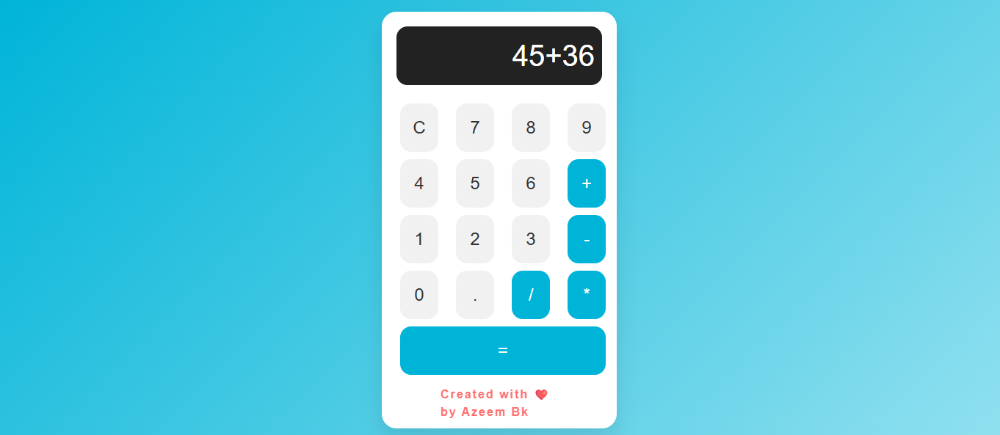

# Stylish Calculator

A beautiful and interactive calculator built with HTML, CSS (Bootstrap), and JavaScript. This calculator comes with a sleek design and user-friendly interface, making it both functional and visually appealing. It also features a watermark at the bottom with a link to "Azeembk.com".

## Features

- Basic arithmetic operations: addition, subtraction, multiplication, and division.
- Clean and modern design with Bootstrap.
- Responsive layout that works on both desktop and mobile devices.
- Watermark with "Created with ❤️ by Azeem Bk" at the bottom, linking to [Azeembk.com](https://Azeembk.com).
- Easy to use and intuitive interface.

## Demo

You can see the live demo of the project here: [Live Demo Link](#)

## Screenshots



## Technologies Used

- **HTML**: The structure and content of the calculator.
- **CSS**: For styling the page and calculator layout (using Bootstrap for responsive design).
- **JavaScript**: To add functionality to the calculator (evaluation of expressions, clear function, etc.).
- **Bootstrap**: For the responsive grid and styling of buttons and layout.

## Installation

To use this project on your local machine:

1. Clone the repository to your local machine:

   ```bash
   git clone https://github.com/your-username/stylish-calculator.git
   ```

2. Navigate into the project directory:

   ```bash
   cd stylish-calculator
   ```

3. Open the `index.html` file in your browser:

   ```bash
   open index.html
   ```

   Or simply double-click the `index.html` file to open it in your browser.

## Usage

1. The calculator supports basic arithmetic operations:
   - **Addition (`+`)**
   - **Subtraction (`-`)**
   - **Multiplication (`*`)**
   - **Division (`/`)**
   - **Decimal points (`.`)**

2. To use the calculator:
   - Click on the buttons to enter numbers and operators.
   - Click the **C** button to clear the input.
   - Press **=** to calculate the result.
   
3. The watermark, **"Created with ❤️ by Azeem Bk"**, will always be displayed at the bottom of the calculator with a clickable link to **Azeembk.com**.

## Contributing

We welcome contributions to this project! If you'd like to contribute, please follow these steps:

1. Fork the repository.
2. Create a new branch (`git checkout -b feature-name`).
3. Make your changes and commit them (`git commit -am 'Add feature'`).
4. Push to the branch (`git push origin feature-name`).
5. Create a new Pull Request.

## License

This project is licensed under the MIT License - see the [LICENSE](LICENSE) file for details.

## Acknowledgements

- **Bootstrap** for providing an easy and responsive grid system and styling.
- **JavaScript** for handling the logic behind the calculator operations.
- **Azeem Bk** for the inspiration behind the project and the watermark.

## Contact

If you have any questions or suggestions, feel free to contact me at:

- [Azeem Bk](https://Azeembk.com)
- Email: azeempersonal4@gmail.com

---

### How to Customize

- You can easily customize the colors, fonts, and layout by modifying the CSS in the `<style>` section of the `index.html` file.
- You can also add more functionality or features to the calculator by enhancing the JavaScript logic.

---

### Notes

- This is a simple static project that does not require any backend or database.
- It's designed for educational purposes and can be extended to include more advanced features like scientific calculations or currency conversions.

---

### Example Folder Structure

```
stylish-calculator/
├── index.html        # The main HTML file
├── README.md         # This README file
├── LICENSE           # The project license (MIT)
└── assets/           # Optional folder for additional assets (e.g., images)
    └── screenshot.png
```

---

This `README.md` file covers everything a user or contributor needs to know about the Stylish Calculator project. It also encourages others to contribute and provides clear installation instructions. Just replace any placeholders (like `your-username` and the `Live Demo Link`) with the actual content once you publish your repository.
